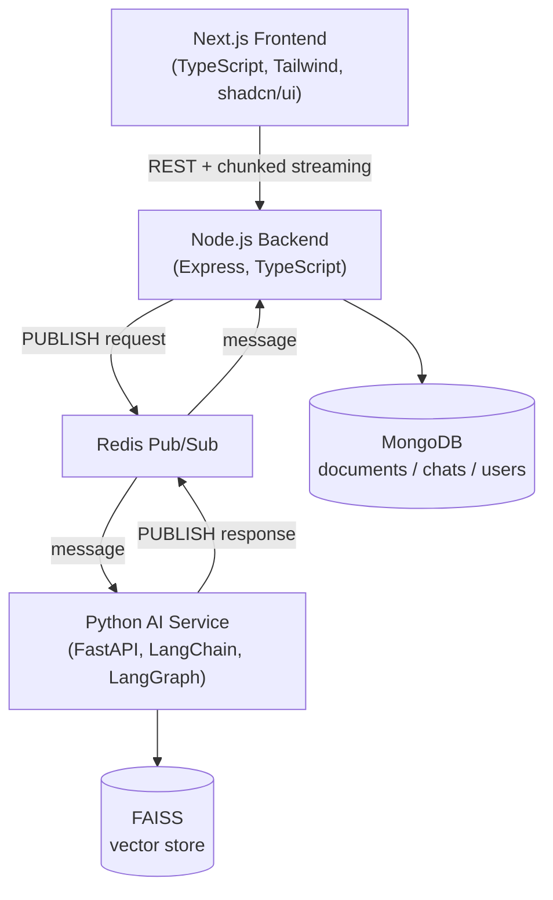
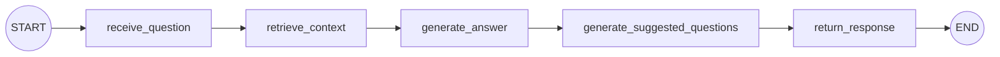

# PDF Knowledge Base AI Chatbot (RAG System)

An admin uploads PDF documents that become an AI chatbot's knowledge base. A public, no-login chat interface answers questions using those documents (source citations + page numbers) and suggests relevant follow-up questions after every answer.

Microservice architecture — the Node backend and Python AI service **never call each other directly**; every AI operation (PDF processing, question answering) crosses **Redis Pub/Sub**.

## Architecture



- **Chat** (a live streaming HTTP connection is waiting): the backend subscribes to a per-request `chat:response:{requestId}` channel *before* publishing `chat:request` — Redis Pub/Sub only delivers to subscribers connected at publish time, so subscribing first avoids dropping the first chunk. python-ai streams the answer back as multiple messages; the backend re-streams them to the browser as newline-delimited JSON (`fetch()` + `ReadableStream`, not `EventSource` — that endpoint needs a POST body).
- **Document processing** (fire-and-forget): the backend registers one persistent `PSUBSCRIBE document:process:response:*` at boot and updates MongoDB whenever a result arrives.
- Full message contract: [`shared/redis-contract.md`](shared/redis-contract.md).

### LangGraph workflow


`chat_history` (conversation memory) is fetched from MongoDB by the backend and passed in per-request — python-ai stays stateless/restart-safe. See [`python-ai/app/graph.py`](python-ai/app/graph.py).

## Project structure
```
frontend/    Next.js (App Router), TypeScript, Tailwind CSS, shadcn/ui
backend/     Node.js, Express, TypeScript
python-ai/   Python, FastAPI, LangChain, LangGraph, FAISS
shared/      Redis Pub/Sub contract + reference TS types
docs/        API reference (docs/api.md)
```

## Tech stack
| Layer | Technology |
|---|---|
| Frontend | Next.js (App Router), TypeScript, Tailwind CSS, shadcn/ui, react-markdown |
| Backend | Node.js, Express, TypeScript, Mongoose, Zod |
| AI Service | Python, FastAPI, LangChain, LangGraph, sentence-transformers |
| Database | MongoDB |
| Vector DB | FAISS (local, persistent, free) |
| LLM providers | Groq / Google Gemini / OpenRouter — swappable via `LLM_PROVIDER` env var |
| Communication | Redis Pub/Sub |

## Setup

### 0. Prerequisites
- Node.js 20+, Python 3.11–3.12 (3.13/3.14 currently lack prebuilt wheels for some ML deps), Docker.
- An API key for **one** of: [Groq](https://console.groq.com) (free tier), [Google AI Studio / Gemini](https://aistudio.google.com) (free tier), or [OpenRouter](https://openrouter.ai) (has free models).

### Environment variables
A single [`.env.example`](.env.example) at the repo root documents every variable for all 3 services (clearly marked with `## backend/.env`, `## frontend/.env.local`, `## python-ai/.env` section headers), since each service reads its own `.env` at runtime - Node's `dotenv`, Next.js, and Python's `pydantic-settings` each only look inside their own directory. It's safe to copy the **whole file** into each service's `.env` as a starting point - every framework here ignores env vars it doesn't recognize, so the other services' sections just sit there unused rather than causing errors.

### 1. Infra (MongoDB + Redis)
```bash
docker compose up -d
```
Runs on non-default ports (`27018`, `6380`) so it can run alongside other local projects.

### 2. Backend
```bash
cd backend
cp ../.env.example .env   # fill in ADMIN_EMAIL / ADMIN_PASSWORD / JWT_SECRET / UPLOAD_DIR
npm install
npm run seed-admin        # creates the one admin account - no public registration
npm run dev                # http://localhost:4000
```
`UPLOAD_DIR` must be an **absolute path** readable by python-ai too (it reads the exact path the backend sends over Redis, not a config of its own — see [`shared/redis-contract.md`](shared/redis-contract.md)).

### 3. Python AI service
```bash
cd python-ai
python -m venv .venv
.venv\Scripts\activate      # Windows; use `source .venv/bin/activate` on macOS/Linux
pip install -r requirements.txt
cp ../.env.example .env     # set LLM_PROVIDER + its API key
uvicorn app.main:app --reload --port 8000
```
The embedding model (`sentence-transformers/all-MiniLM-L6-v2`) downloads automatically on first run (~90MB, one-time, fully local/free after that).

### 4. Frontend
```bash
cd frontend
cp ../.env.example .env.local
npm install
npm run dev                 # http://localhost:3000
```

### 5. Try it
1. Log in at `http://localhost:3000/admin/login` with the seeded admin credentials.
2. Upload a PDF at `/admin/documents` — status flips `pending → processing → completed`.
3. Go to `http://localhost:3000/` (no login) and ask a question — watch the streamed answer, source citations, and suggested follow-up questions.

## Switching LLM providers
Set `LLM_PROVIDER=groq|gemini|openrouter` in `python-ai/.env` and fill in that provider's API key/model. See `python-ai/app/llm.py`.

## Database schema (MongoDB)
- **AdminUser** — `email`, `passwordHash`, `name`. Provisioned only via `npm run seed-admin`.
- **Document** — `fileName`, `originalName`, `filePath`, `uploadDate`, `status` (`pending`/`processing`/`completed`/`failed`), `pageCount`, `chunkCount`, `errorMessage`.
- **ChatSession** — `sessionId` (client-generated uuid, no auth), `createdAt`, `lastActivityAt`.
- **ChatMessage** — `sessionId`, `question`, `answer`, `sources[]`, `suggestedQuestions[]`, `timestamp`.

Vectors live only in FAISS (`python-ai/faiss_index/`), never in MongoDB — each chunk's metadata carries `{documentId, fileName, page, chunkIndex}`. A small sidecar `doc_chunk_ids.json` in that same directory maps `documentId -> [chunk ids]` so a single document's vectors can be deleted/reprocessed (FAISS has no server-side metadata-filtered delete like Chroma).

## API reference
See [`docs/api.md`](docs/api.md).

## Security

**Implemented:**
- Passwords hashed with bcrypt (cost 12); JWTs carry no sensitive data and `passwordHash` is `select: false` on the schema (never returned by a stray query).
- All mutating input validated with Zod (body/query/route-params), including UUID/ObjectId shape checks on path params so malformed IDs get a clean 400 instead of an unhandled DB error.
- Document search input is regex-escaped before use in a Mongo `$regex` filter (prevents ReDoS/behavior-altering metacharacters from user input).
- Upload validation is layered: multer's mimetype/extension `fileFilter` (cheap, first line) **plus** a magic-byte check (`%PDF-`) on the saved file's actual bytes, since mimetype/extension are fully client-controlled and trivially spoofed.
- `helmet()` on the backend; the frontend sets `X-Frame-Options`, `X-Content-Type-Options`, `Referrer-Policy`, `Permissions-Policy`, and a `Content-Security-Policy` in production builds (`frontend/next.config.js`).
- Rate limiting: global, a strict limiter on admin login, and a strict limiter on the public (unauthenticated) `/chat/ask` — every call there costs an LLM request.
- CORS locked to `CORS_ORIGIN`; `trust proxy` is off unless `TRUST_PROXY=true` is explicitly set (never blindly trust `X-Forwarded-For`).
- No admin self-registration — the only account-creation path is the seed script, run by whoever controls the server's env vars.
- `.env*` (everything except `.env.example`) is gitignored throughout the repo.
- Process-level `unhandledRejection`/`uncaughtException` handlers in the backend log full context and exit, rather than continuing in a possibly-corrupted state (see below).
- Mongo/Redis ports are bound to `127.0.0.1` only in `docker-compose.yml` (Docker's default `"host:container"` form with no bind address publishes to `0.0.0.0` — reachable from any network interface on the host, not just localhost).
- **Redis Pub/Sub messages have no per-message authentication** by design (see `shared/redis-contract.md`) — python-ai trusts that only the backend can reach Redis. As a second line of defense in case that assumption is ever wrong, python-ai independently validates every `file_path` it receives actually resolves **inside** its configured `UPLOAD_DIR` before opening it, so a forged/malformed message can't be used to read arbitrary files off the host and leak them into the (publicly queryable) knowledge base.

**Before deploying this anywhere beyond localhost**, close these gaps (deliberately left out of a local docker-compose dev setup):
- **MongoDB/Redis have no auth** — binding to `127.0.0.1` closes remote network access, but anything running locally on the same host can still connect with zero credentials. Add `MONGO_INITDB_ROOT_USERNAME`/`PASSWORD` and Redis `requirepass`/ACLs before running on any shared or multi-tenant host, and put both behind a private network / security group if deployed beyond a single machine.
- **No TLS** anywhere in this local setup (HTTP between all services). Terminate TLS at a reverse proxy (nginx/Caddy/ALB) in front of the frontend and backend.
- **JWT is access-token-only** (2h expiry, no refresh flow, no revocation list) — acceptable for a single admin account in an assignment, not for multi-admin production use.
- **`rate-limit`'s default store is in-memory**, per-process — fine for one instance, but doesn't share state across multiple backend replicas. Swap in `rate-limit-redis` (Redis is already a dependency here) if you scale horizontally.

## Known trade-offs
- Redis Pub/Sub (mandated over Streams/queues) delivers only to currently-connected subscribers — if python-ai is momentarily down, a request is silently lost. Mitigated with request timeouts (chat) and a `staleDocumentReaper` that fails out documents stuck in `processing` (details in `shared/redis-contract.md`).
- No refresh-token flow — the admin JWT is a single 2h access token (re-login after expiry).

## What's not included here
- **Public GitHub repository**: push this project to your own repo when ready.
- **Demo video**: record a 5–10 min walkthrough covering the architecture, Redis Pub/Sub flow, LangGraph workflow, PDF upload, and the chat + suggested-questions feature.
