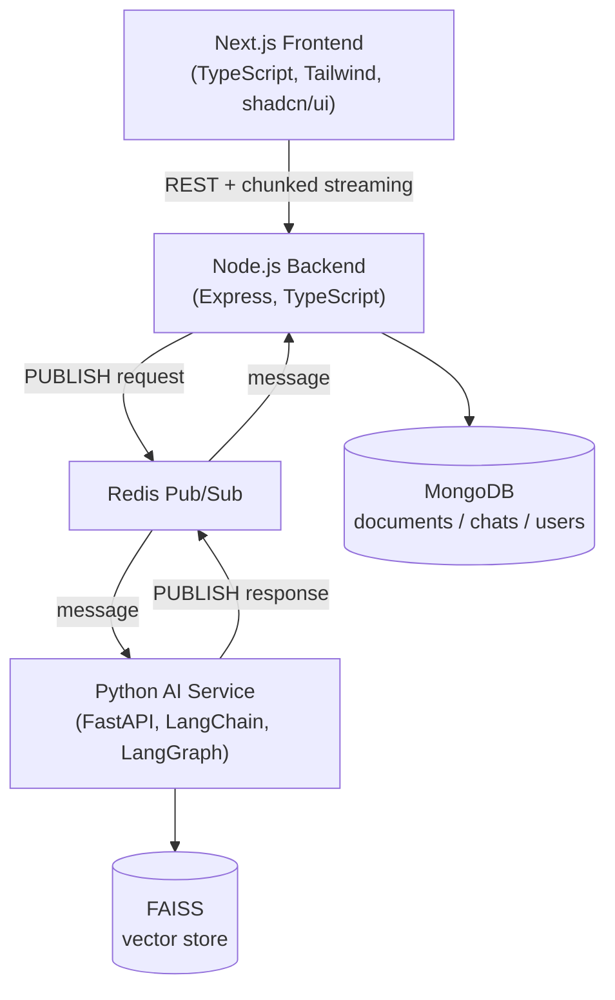
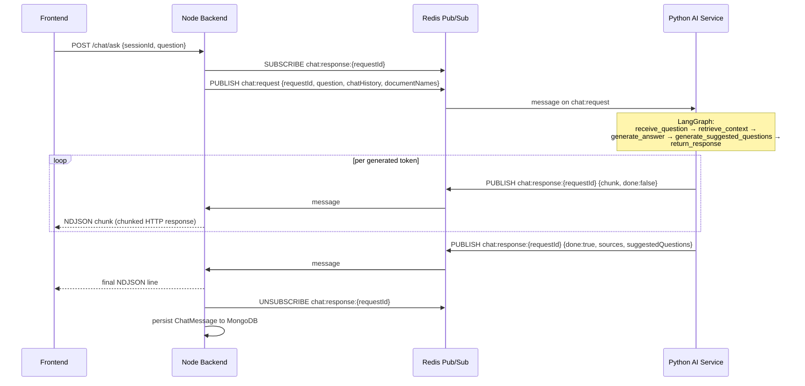
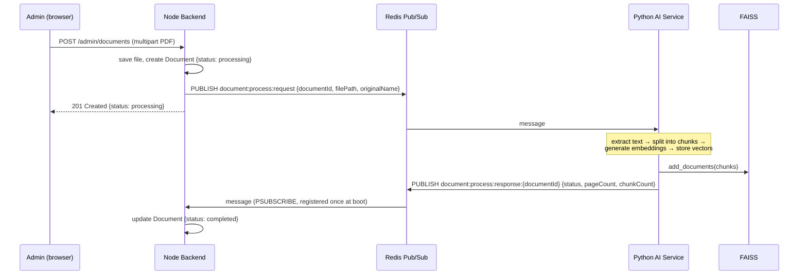
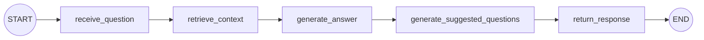

# Architecture

Microservice architecture: a Next.js frontend, a Node.js/Express backend, and a Python/FastAPI AI service. The backend and the AI service **never call each other directly** — every AI operation (chat, document processing, document deletion) crosses **Redis Pub/Sub**. Full message contract: [`../shared/redis-contract.md`](../shared/redis-contract.md).

## System overview

Every edge in this diagram was independently verified live against the running system — not just asserted: the `FE→BE` edge by inspecting the streamed response's `Content-Type: application/x-ndjson` and timing individual chunk arrivals; the `BE↔Redis↔AI` edges by capturing actual `redis-cli MONITOR` traffic during a real request; `AI→FAISS` and `BE→Mongo` by querying both stores directly.

## Chat flow (synchronous from the user's perspective — streaming)

A live HTTP connection is waiting on the backend, so it **subscribes to a per-request response channel before publishing the request** — Redis Pub/Sub only delivers to subscribers connected at publish time, so subscribing first avoids a race where an early token gets dropped.

`documentNames` is the current list of successfully-embedded documents, fetched fresh from MongoDB on every request — the AI service otherwise has no way to know what's actually in the knowledge base (it only ever sees individual retrieved chunks, never a manifest), which without this caused real, observed misidentification of documents merely *referenced inside* another document's content.

The backend re-streams chunks to the browser as `application/x-ndjson` (not SSE/`EventSource` — the endpoint needs a POST body, which `EventSource` can't send). The subscription is torn down on `done`, on timeout (`CHAT_REQUEST_TIMEOUT_MS`), or immediately if the client disconnects.

## Document processing flow (fire-and-forget — no caller waiting)

Upload and "Reprocess" both publish the same message; delete is separate and doesn't wait for a response.

The backend registers **one persistent `PSUBSCRIBE document:process:response:*`** at boot rather than a per-request subscription, since no HTTP caller is waiting for this one. Delete follows the same fire-and-forget shape: the backend removes the Mongo record and disk file immediately, and separately publishes `document:delete:request` so python-ai can purge that document's vectors from FAISS.

## LangGraph workflow

Verified directly against the *compiled* graph object (`get_chat_graph().get_graph()`), not just the source — this is the actual runtime structure, strictly linear as mandated, no conditional branches:

Source: [`../python-ai/app/graph.py`](../python-ai/app/graph.py).

## Direct communication boundary

Verified at three independent levels, not just by design intent:

1. **Code** — zero references to the backend's host/port anywhere in python-ai, zero references to python-ai's host/port anywhere in the backend. python-ai's FastAPI app exposes exactly one HTTP route, `/health` — nothing AI-related is reachable over HTTP.
2. **Message bus** — live `redis-cli MONITOR` capture during a real request showed the entire request/response cycle happening exclusively over `chat:request` / `chat:response:{id}`.
3. **Network** — OS-level TCP connections polled every 500ms for the full duration of a real request: python-ai's port never once showed an `ESTABLISHED` connection from the backend, or vice versa.

## Related documents
- [Redis Pub/Sub contract](../shared/redis-contract.md) — full message shapes for both flows above
- [Database schema](db-schema.md) — MongoDB collections (ER diagram + field reference)
- [API reference](api.md) — REST endpoints
