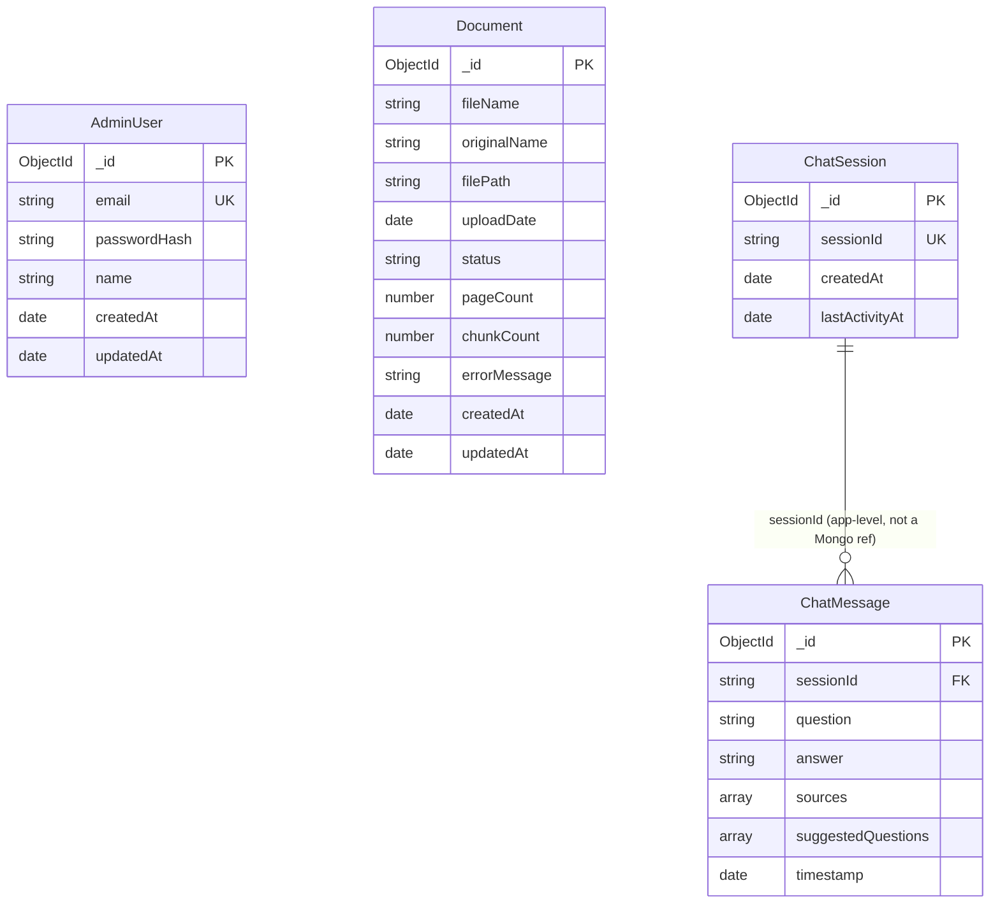

# Database Schema

Database: **MongoDB** (Mongoose). Connection: `MONGO_URI` in `backend/.env`. All 4 collections are defined in `backend/src/models/`.

Vectors are **not** stored here — they live only in FAISS (`python-ai/faiss_index/`), owned exclusively by the Python AI service. This database holds metadata and conversation history only. See [`redis-contract.md`](../shared/redis-contract.md) for how the two stay in sync.

## `AdminUser`
Source: [`backend/src/models/AdminUser.model.ts`](../backend/src/models/AdminUser.model.ts)

| Field | Type | Constraints |
|---|---|---|
| `_id` | ObjectId | primary key |
| `email` | String | required, **unique**, indexed, lowercased/trimmed |
| `passwordHash` | String | required, bcrypt (cost 12), `select: false` — never returned by a default query |
| `name` | String | required |
| `createdAt` / `updatedAt` | Date | auto (`timestamps: true`) |

No public registration endpoint exists — the only account-creation path is `backend/scripts/seed-admin.ts`, run from `ADMIN_EMAIL` / `ADMIN_PASSWORD` / `ADMIN_NAME` env vars.

## `Document`
Source: [`backend/src/models/Document.model.ts`](../backend/src/models/Document.model.ts)

| Field | Type | Constraints |
|---|---|---|
| `_id` | ObjectId | primary key |
| `fileName` | String | required — the random UUID-based name on disk (`storage/uploads/`) |
| `originalName` | String | required — the human-readable name shown in the UI and cited as a chat source; indexed with a `text` index for admin search |
| `filePath` | String | required — absolute path on disk, sent to python-ai over Redis (never the file bytes) |
| `uploadDate` | Date | required, defaults to now |
| `status` | String enum | `pending` \| `processing` \| `completed` \| `failed`, indexed |
| `pageCount` | Number | optional — set once processing completes |
| `chunkCount` | Number | optional — set once processing completes |
| `errorMessage` | String \| null | set when `status: 'failed'` |
| `createdAt` / `updatedAt` | Date | auto |

`updatedAt` is also what `staleDocumentReaper` checks against `STALE_DOCUMENT_TIMEOUT_MINUTES` to fail out documents stuck in `processing` (see [`redis-contract.md`](../shared/redis-contract.md)).

## `ChatSession`
Source: [`backend/src/models/ChatSession.model.ts`](../backend/src/models/ChatSession.model.ts)

| Field | Type | Constraints |
|---|---|---|
| `_id` | ObjectId | primary key |
| `sessionId` | String | required, **unique**, indexed — a client-generated UUID (`crypto.randomUUID()`), kept in the browser's `sessionStorage`. No login for the public chat. |
| `createdAt` | Date | defaults to now |
| `lastActivityAt` | Date | updated on every message in the session |

Upserted on a session's first message. `countDocuments()` on this collection backs the dashboard's "Total Chat Sessions" stat.

## `ChatMessage`
Source: [`backend/src/models/ChatMessage.model.ts`](../backend/src/models/ChatMessage.model.ts)

| Field | Type | Constraints |
|---|---|---|
| `_id` | ObjectId | primary key |
| `sessionId` | String | required, indexed — links to `ChatSession.sessionId` (application-level join, not a Mongo `ref`/populate, since sessions are looked up by this string, not `_id`) |
| `question` | String | required |
| `answer` | String | required — the full accumulated text after streaming completes |
| `sources` | `[{ documentName: String, page: Number }]` | default `[]` |
| `suggestedQuestions` | `[String]` | default `[]`, 3–5 items |
| `timestamp` | Date | defaults to now, indexed |

One row per question/answer turn. `countDocuments()` on this collection backs the dashboard's "Total Questions Asked" stat. The last N rows per `sessionId` (sorted by `timestamp`) are read by the backend and sent to python-ai as `chatHistory` on every request, giving the stateless AI service its conversation memory (see the LangGraph workflow in the root [`README.md`](../README.md)).
